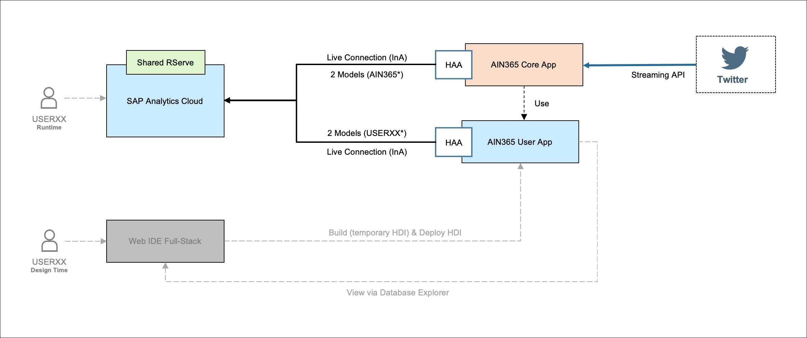
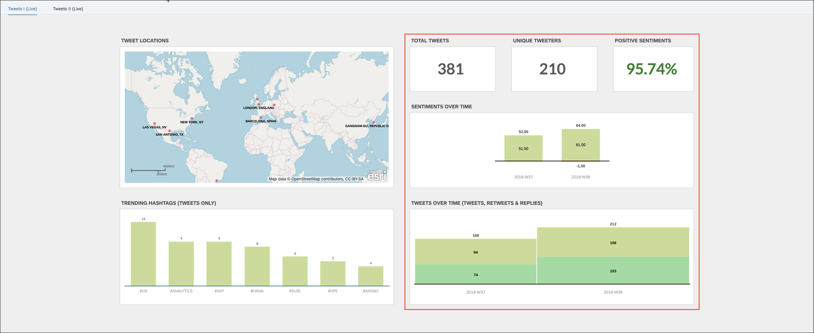
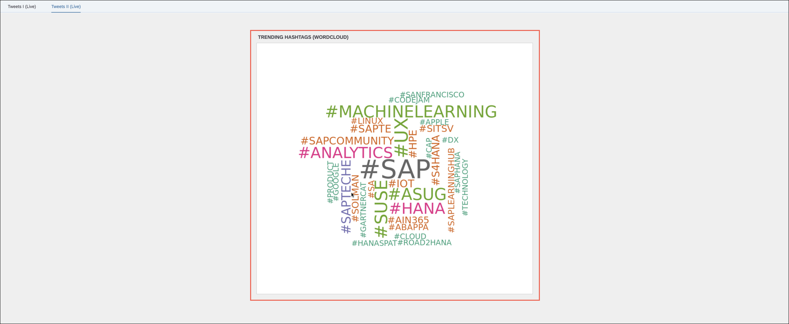

#### AIN365

## Description

In this session, you will get hands-on experience with SAP Cloud Platform and the SAP Analytics Cloud solution. We will use the SAP HANA business data platform on SAP Cloud Platform as a data mart, storing our data and using different analytics capabilities. With SAP Analytics Cloud, you can create appealing dashboards and reports on top of this data, and share with other users in your organization – eventually integrating this smoothly into your overall cloud applications.  
The data, which is analyzed in the overall SAP Analytics Cloud dashboard is coming from Twitter. Every Tweet including hashtag #SAPTechEd is stored in the SAP HANA database inside SAP Cloud Platform. During the session you will reuse an already prepared template, clone it in SAP Web IDE Full-Stack and adjust it to your user. Besides that, you will then enrich the template application and create your own calculation views. Afterwards a Live Data Connection between SAP Analytics Cloud and SAP HANA in SAP Cloud Platform is created. Through this live connection the calculation views are then visible in SAP Analytics Cloud and can be reused there to create a dashboard on top.  
  
The goal of this session is to create the dashboard below in SAP Analytics Cloud, including all the necessary steps in SAP HANA and SAP Analytics Cloud.  
The left side of the dashboard is already predefined and included in the template, which will be cloned later. The left side includes a map, showing where all the different tweets are coming from. At the bottom a bar chart is visible, to get the trending hashtags, which are included in the source data (which hashtags are mentioned often in the Tweets, except of #SAPTechEd).  
The right side of the dashboard will be created during the exercises. It contains 3 KPIs showing the total number of Tweets, the number of Twitter users and a percentage illustrating the amount of positive Tweets overall. The second chart splits up the sentiments, to see the exact amounts of positive and negative Tweets over time. The last chart illustrates the number of Tweets over time.  
  
If you are more advanced and can finish with the first dashboard earlier, you can also create an additional chart using the integrated R server in SAP Analytics Cloud. With this you can create charts using R script and therefore charts can be included, which are not in the predefined list of SAP Analytics Cloud. During the optional exercises below, a Wordcloud is created showing the trending hashtags.  
  
If you need additional visualization to complete the exercises, you can follow the YouTube playlist below. There all the steps of the exercises are recorded for you.  
YouTube Playlist:

- [AIN365 Exercises - Basic](https://www.youtube.com/playlist?list=PLbtEdO-uVjjeHhMfXhDnLv4jJvd0XHxin)
- [AIN365 Exercises - Intermediate](https://www.youtube.com/playlist?list=PLbtEdO-uVjje0hUNt52BgzWxbMeI3xJKo)

 

> **NOTE**
>
> The videos are recorded with a resolution of 2560x1440 pixels. Therefore we recommend you to view the playlists on a high-resolution screen, e.g. your Desktop.

 

## Exercises
As there are participants with different background, we created two different lines to follow the exercises.  
If you have very little background with SAP HANA and or SAP Cloud Platform, cloud foundry environment, please follow the description **Exercies - Basic**. In these exercises we reduced the depth and number of steps you are fulfilling in SAP HANA. You will copy the major part of the HANA content and deploy it to SAP Cloud Platform, cloud foundry environment. You will only do very little modifications on the HANA content and focus more on the visualization in SAP Analytics Cloud. But you will still have the end-to-end approach.  
If you are more experienced with SAP HANA and or SAP Cloud Platform, cloud foundry environment and how to deploy applications there, you can go for the full end-to-end approach with **Exercises - Intermediate**. There you will do more modifications in the SAP HANA database and deploy it to SAP Cloud Platform, cloud foundry environment. The second part, looking at the visualization in SAP Analytics Cloud is the same as in the "Basic" line of exercises.   
### Exercises - Basic

- [Exercise 1 - Setup & adjust complete template project](exercise1-1/README.md)
- [Exercise 4 - Setup HANA Analytics Adapter](exercise4/README.md)
- [Exercise 5 - Prepare SAP Analytics Cloud](exercise5/README.md)
- [Exercise 6 - Implement your dashboard](exercise6/README.md)
- [Optional: Exercise 7 - Validate your dashboard](exercise7/README.md)
- [Optional: Exercise 8 - Extend with R Visualization](exercise8/README.md)
  

### Exercises - Intermediate

- [Exercise 1 - Setup & adjust template project](exercise1/README.md)
- [Exercise 2 - Tweet Sentiments](exercise2/README.md)
- [Exercise 3 - Tweets over time](exercise3/README.md)
- [Exercise 4 - Setup HANA Analytics Adapter](exercise4/README.md)
- [Exercise 5 - Prepare SAP Analytics Cloud](exercise5/README.md)
- [Exercise 6 - Implement your dashboard](exercise6/README.md)
- [Optional: Exercise 7 - Validate your dashboard](exercise7/README.md)
- [Optional: Exercise 8 - Extend with R Visualization](exercise8/README.md)
   

## License

This project is licensed under the SAP SAMPLE CODE LICENSE AGREEMENT except as noted otherwise in the [LICENSE file](LICENSE).
