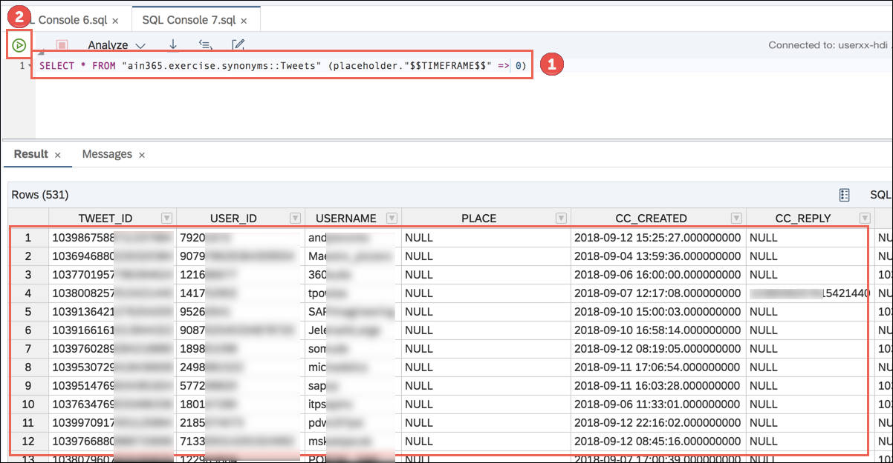
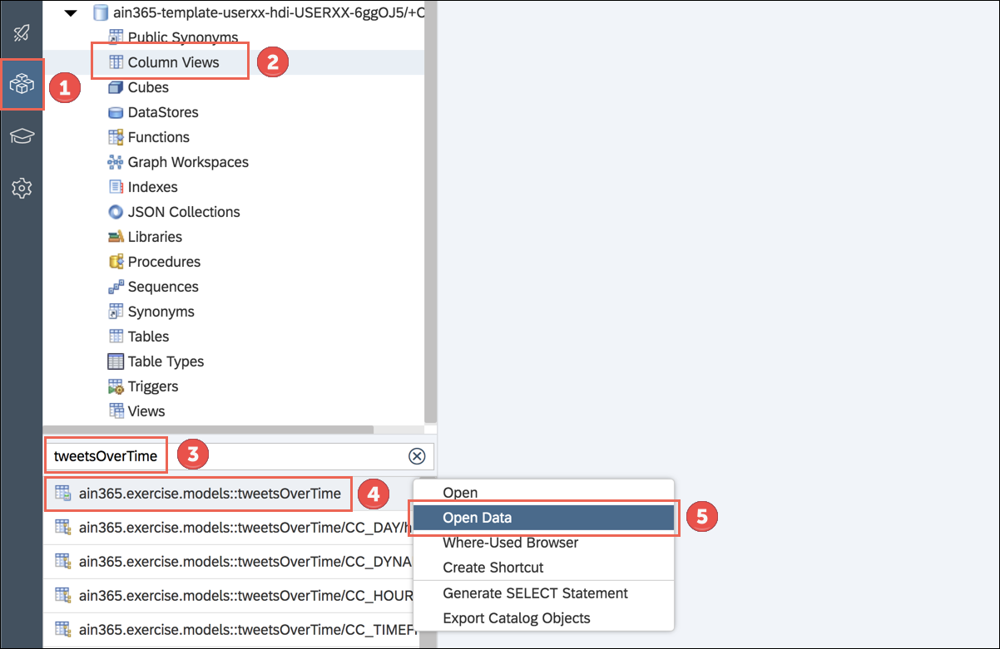
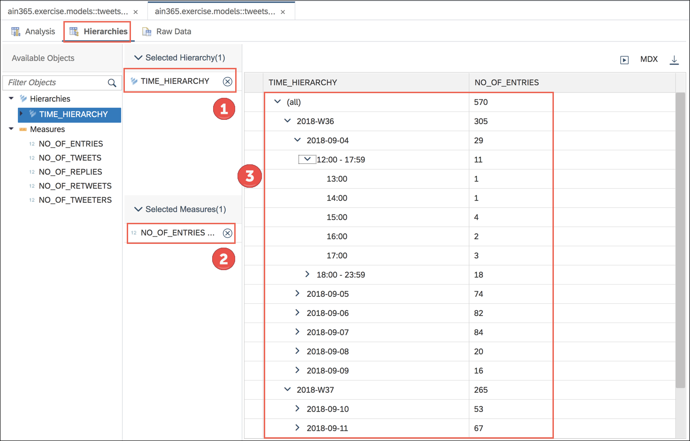

#### AIN365

## Exercise 1 - Setup & adjust complete template project
*This is the first exercise for "Exercises - Basic".*

In this exercise you will clone our [project template](https://github.com/AIN365/ain365-template) in SAP Web IDE Full-Stack and adapt it to your exercise user (e.g. userxx).

The module connects to our existing HDI container (HANA Deployment Infrastructure), adds additional permissions for the SAP HANA Analytics Adapter and gives you access to all required objects for the exercises.  
  
The planned duration for this exercise is 25 minutes. You can find a recording of the exercise [here](https://youtu.be/bJEQMns7Xm0).   

## Steps

Run the following steps to complete the exercise:  

Open the **AIN365 Launchpad** in Google Chrome and click on the **SAP Web IDE Full-Stack** tile.  
  
Logon with your **AIN365 user** (user + your number + @consarea.org, e.g. user01@consarea.org) and **Welcome18** as password.  
  
Click the **Clone from Git Repository** link on the overview page.  
  
Copy **https://github.com/AIN365/ain365-template-basic.git** and paste the link to the field **URL** within the **Clone Git Repository** dialog. Afterwards confirm with **Clone**.  
  
Wait until the project has been cloned successfully. It will automatically navigate you to the **Project Explorer** afterwards.  
Select your **mta.yaml** file, right-click and choose the option **Open Code Editor**.  
  
Replace **TEMPLATE_USER** with your **AIN365_USER** (e.g. userxx). It's required to get unique projects for each hands-on participant.  
  
Afterwards the file should look like the one below (e.g. user01 instead of userxx):  
  
Click on **Save** (File > Save).  
  
Mark the **ain365-template-basic** project [1], right-click on it and select **Build** > **Build** [2]. This will create a Multi-Target Application Archive (MTAR).  
  
Wait until the build process has been completed.  
You will either get the notification **Build of "/ain365-template-basic" completed** [1] or you can indicate it in the console showing the message **Build of /ain365-template-basic completed successfully** [2].  
 
  
Navigate to the folder containing your user via **mta_archives** [1] > **userxx-exercise** (e.g. user01-exercise) and right click on the **mtar** [2] file (here userxx-exercise_1.0.0.mtar). Choose **Deploy** > **Deploy to SAP Cloud Platform** [3].  
  
Select your **Cloud Foundry API Endpoint** [1] and keep the default **Organization** [2] and **Space** [3]. Afterwards click on **Deploy**  
> **!! CAUTION !!**
>
> Please use the API endpoint "https://api.cf.eu10.hana.ondemand.com" for Barcelona and Bangalore and "https://api.cf.us10.hana.ondemand.com" for Las Vegas.

 

  
Wait until the deploy process has been finished successfully. This can take up to 5 minutes. You will get a confirmation message as notification [1] and in the console [2] once the deployment has been finished.  
 
  
Open the **Database Explorer** [1] from the menu bar. Afterwards click on **Connect** [2] in the **Database Explorer Connectivity** dialog.  
  
In the upcoming **Database Explorer** dialog confirm the question "Do you want to add one now?" with **Yes**.  
  
Select the **HDI container** containing your user (e.g. userxx) and click on **OK**.  
  
In the **Database Explorer** select your HDI container and navigate to **Synonyms** [1].  
There are 2 synonyms available. **Right-Click** on the first one named "**ain365.exercise.synonyms::TweetSentiments**" and select **Open Data** [2].  
  
Ensure that you get data for the consumed view.  
  
For the second view named "**ain365.exercise.synonyms::Tweets**" an input parameter is required, as there's no default parameter in the mapping of the source view.  
Click on the **SQL Console** icon in the top left corner to open a new instance.  
  
Insert `SELECT * FROM "ain365.exercise.synonyms::Tweets" (placeholder."$$TIMEFRAME$$" => 0)` to the console [1] and click on the **Open Content** [2] icon. Ensure that you get data for the second view as well.  
  
In the **Database Explorer** [1] navigate to the entry **Column Views** [2] and select and right-click the corresponding calculation view with the name "**ain365.exercise.models::tweetSentiments**" [3]. Finally choose **Open Data** [4].  
  
Set the **Input Parameters** for **TIMEFRAME** [1] to the value **0** and keep the other settings untouched. Afterwards click on the **Open Content** [2] icon.  
  
Select **CC_DYNAMICBASKET_DISPLAY** as **Label Axis** [1] and add the three measures **CC_POSITIVE**, **CC_NEGATIVE** and **CC_NEUTRAL** to the **Value Axis** [2]. You should see a simple bar chart visualizing the sentiments by calendar week.  
  
Navigate to the **Database Explorer** [1] and select again **Column Views** [2]. Filter for **tweetsOverTime** [3], right-click on the view "**ain365.exercise.models::tweetsOverTime**" [4] and choose **Open Data** [5].  
  
Set the **Input Parameters** for **TIMEFRAME** [1] to the value **0** and keep the other settings untouched. Afterwards click on the **Open Content** [2] button.  
  
Select **CC_DYNAMICBASKET_DISPLAY** as **Label Axis** [1] and the measures **NO_OF_ENTRIES**, **NO_OF_TWEETS**, **NO_OF_REPLIES**, **NO_OF_RETWEETS** and **NO_OF_TWEETERS** to the **Value Axis** [2]. You should see a simple bar chart visualizing the sentiments by calendar week.  
  
Switch to the **Hierarchies** tab. Select **TIME_HIERARCHY** as **Selected Hierarchy** [1] and **NO_OF_ENTRIES** as **Selected Measures** [2]. Drill-down on the output table to the various levels [3].  
  
**Congratulations! You have successfully completed the first exercise.**   

## Next Steps
Exercise 1 of *Exercises Basic* is the sum of the exercises 1-3 of *Exercises Intermediate*. Therefore you can now skip exercises 2 and 3 and directly continue with [Exercise 4](../exercise4/README.md) and deploy the SAP HANA Analytics Adapter to Cloud Foundry.
   

## Optional: Additional Infos

The project template already contains some predefined files (here explained on the equal ain365-template project). This optional section gives you information on what they're about. 

**For the SAP HANA Analytics Adapter there are additional permissions required besides the PUBLIC role**. Those permissions (a simple role) are granted through a **User-Provided Service** named "**xsahaa-access**". It's already created in the Cloud Foundry Space and just needs to be configured.  
  
In the **mta.yaml** the resource "**xsahaa-access**" is referenced and set in the "**userxx-db**" module as required.  
  
In addition there's a second file named "**xsahaa-access.hdbgrants**" which grants the role "**AIN365_Role**", containing the additional permissions, to the **application_user**. The **container_user** does not require those additional permissions.  
  
Besides the additional permissions, the existing core HDI container, named "**ain365-hdi**", needs to be connected and two synonyms are created to consume the required views.  
  
To connect to the existing HDI container "**ain365-hdi**" the resource needs to be added to the "**mta.yaml**" file. In addition it is added to the "**userxx-db**" module and the required additional properties like **TARGET_CONTAINER**, **SERVICE_REPLACEMENTS**, etc. are specified.  
  
The target application containing the views provides the container roles "**external_access_g#**" (with GRANT privilege) as well as the role "**external_access**". These roles are used to grant access to the schema containing the synonym's target object.  
  
Two synonyms are specified in the "**ain365-core.hdbsynonym**" file. The synonym configuration is not included in this case. It's moved to the synonyms's corresponding configuration file named "**ain365-core.hdbsynonymconfig**", as described in the next step.   
  
Rather than defining a schema and a concrete schema name, `schema.configure` is used to specify a path to a service name. The path expression is replaced at deployment time with the name of the schema of the referenced service.   
   

## Next Steps
Continue with [Exercise 4](../exercise4/README.md) and deploy the SAP HANA Analytics Adapter to Cloud Foundry.
   

## License
This project is licensed under the SAP SAMPLE CODE LICENSE AGREEMENT except as noted otherwise in the [LICENSE](../LICENSE) file.
