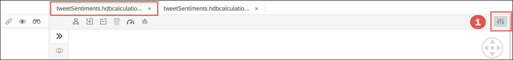

#### AIN365

## Exercise 2 - Tweet Sentiments
*If you are following the "Exercises - Basic", you can skip this exercise.*

In this exercise you will use the data from the core application and build a Calculation View to analyze the Twitter sentiments. Therefore, the Tweets CDS table as well as the provided HANA Full-Text Index output (containing the sentiments) are used and joined together.   
  
The planned duration for this exercise is 20 minutes. You can find a recording of the exercise [here](https://youtu.be/tb8LOple4Fs).   

## Steps

Run the following steps to complete the exercise:  

Right-click on the **src** folder (ain365-template > db > src) and select **New** > **Folder**.  
  
Enter **models** as **Folder Name** and click **OK**.  
  
Right-click on the newly created **models** folder and select **New** > **Calculation View**.  
  
Enter **tweetSentiments** as **Name**, **Tweet Sentiments** as **Label** and click **Create**.  
  
> **NOTE**
>
> We need to add three parameters with multiple values to the calculation view and map it with the view from the synonym. To simplify this step, we insert the parameters directly to the XML file.

 
Right-click on the newly created calculation view "**tweetSentiments.hdbcalculationview**" and select **Open Code Editor**.  

  
Mark the text `<localVariables/>` on line 4 and replace it with the [snippet](../misc/localVariables.txt) copied from the documentation repository.   **Don't forget to save the XML file.**  
  
The XML file should look like this afterwards:  
  
Switch back to the **Calculation View Modeler** and click the **Expand Details Panel** [1] icon in the top right corner.  
  
Select **Parameters** [1] and you can see the three parameters [2] you added directly to the XML file.  
  
Close the **Details Panel**.  
On the **Calculation View Editor** click on the **Join** [1] icon and place the new node below the **Aggregation** [2] node.  
  
Right-click on the **Join_1** node and select **Rename**. Rename it to **Join_TweetsSentiments** to indicate that we join the Tweets with the Sentiments.  
  
Select the **Join_TweetsSentiments** node and click on the **Plus** [1] sign.  
  
In the **Find Data Sources** dialog search for **Tweets** [1] and **select both views (TweetsSentiments and Tweets)** [2]. Afterwards click on **Finish**.  

> **!! CAUTION !!**
>
> Pay attention to the names shown in the results table. You will find the views from exercise 1 in the "Synonym" column.

 

  
As a result you will find both views in the **Join_TweetsSentiments** node. Click on the **Expand Details Panel** [1] icon next to the join node.

> **NOTE**
>
> If you didn't close the details panel in the steps before, it is already open on the right side of your screen.

 

  
In the **Join Definition** tab, drag & drop the **TWEET_ID** [1] property from the left table to the right. Change the cardinality [3] from **m:n** to **1:1**. Keep the other settings as default, e.g. INNER as Join Type.  

> **NOTE**
>
> You can find the cardinality setting in the "properties" [2] section. In case the properties is closed, you have to open it.

 

 
  
Switch to the **Mapping** section.  
Drag & drop the columns listed below to the output columns.

- **Tweets** data soure: **TWEET_ID**, **PLACE**, **CC_DYNAMICBASKET**, **CC_DYNAMICBASKET_DISPLAY**
- **TweetSentiments** data source: **NEUTRAL**, **WEAK_POSITIVE**, **WEAK_NEGATIVE**, **STRONG_POSITIVE**, **STRONG_NEGATIVE**  

> **NOTE**
>
> The order you perform the drag & drop of the nodes doesn't matter. You can e.g. start with the whole TweetSentiments node, delete the not required columns in the output columns and finally add the Tweet columns.

 

  
Switch to the section **Calculated Columns** [1]. Click on the **Plus** sign [2]. It will automatically add a new entry named **CC_1** [3]. Click on it to open the details.  
  
Change the **Name** [1] from **CC_1** to **CC_POSITIVE** and the **Data Type** [2] to **DOUBLE**.  
Open the **Expression** [3] section, change from **SQL** to **Column Engine** [4] and enter the following calculation statement `"STRONG_POSITIVE" + ("WEAK_POSITIVE" * 0.5)` [5]. Afterwards click on the **Validate Syntax** [6] button.  
  
Once the validation was successful, you'll get a confirmation message. Click OK.  
  
Repeat the steps and create two more calculated columns with data type **DOUBLE**: one named **CC_NEGATIVE** [1] with the expression `"STRONG_NEGATIVE" + ("WEAK_NEGATIVE" * 0.5)` and one named **CC_NEUTRAL** [2] with the expression `"NEUTRAL" * 0.5`. Afterwards close the **Details Panel**.  
  
Select the **Join_TweetsSentiments** node and select the **Connect** tool [1]. Drag & drop the arrow (Connect tool) from the **Join_TweetsSentiments** node to the **Aggregation** node.  
  
There's a connection between both nodes now [1]. Click on the **Expand Details Panel** [2] of the **Aggregation** node.

> **NOTE**
>
> If you didn't close the details panel in the steps before, the button will not show up and the panel is already open on the right side of your screen.

 

  
On the **Mapping** section add the columns **TWEET_ID**, **PLACE**, **CC_DYNAMICBASKET**, **CC_DYNAMICBASKET_DISPLAY**, **CC_POSITIVE**, **CC_NEGATIVE** and **CC_NEUTRAL** to the **Output Columns**.  
  
Switch to section **Parameters** [1] and click on the **Manage Parameter Mapping** [2] icon.  
  
In the **Manage input parameter mappings** section click on the **Auto Map by Name** icon [1]. As the names are the same it will automatically map the parameters.  
  
Click on **Semantics** in the **Calculation View Editor** and open the **Details panel**.  
Choose the section **Columns** and change the **Label** [1] columns for **CC_POSITIVE**, **CC_NEGATIVE** and **CC_NEUTRAL**. In addition set the column **CC_DYNAMICBASKET_DISPLAY** to **Hidden** [2] and map the **Label Column** for **CC_DYNAMICBASKET** to **CC_DYNAMICBASKET_DISPLAY** [3].  
  
Right-click on the calculation view **tweetSentiments.hdbcalculationview** and choose **Build** > **Build Selected Files**.  
  
Wait until the build process is finished and click **Database Explorer** [1].  
Navigate to the entry **Column Views** [2] and select and right-click the corresponding calculation view with the name "**ain365.exercise.models::tweetSentiments**" [3]. Finally choose **Open Data** [4].  
  
Set the **Input Parameters** for **TIMEFRAME** [1] to the value **0** and keep the other settings untouched. Afterwards click on the **Open Content** [2] icon.  
  
Select **CC_DYNAMICBASKET_DISPLAY** as **Label Axis** [1] and add the three measures **CC_POSITIVE**, **CC_NEGATIVE** and **CC_NEUTRAL** to the **Value Axis** [2]. You should see a simple bar chart visualizing the sentiments by calendar week.  
  
**Congratulations! You have successfully completed the second exercise.**   

## Next Steps
Continue with [Exercise 3](../exercise3/README.md) and create the second calculation view.
   

## License

This project is licensed under the SAP SAMPLE CODE LICENSE AGREEMENT except as noted otherwise in the [LICENSE file](../LICENSE).
