#### AIN365

## Exercise 3 - Tweets over time
*If you are following the "Exercises - Basic", you can skip this exercise.*

In this exercise you will create another Calculation View and analyze the tweets over time using a hierarchy and multiple date functions.  
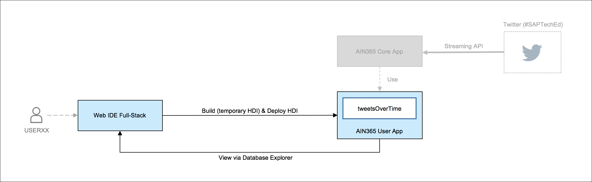  
The planned duration for this exercise is 20 minutes. You can find a recording of the exercise [here](https://youtu.be/z0V4EB22Tjs).   

## Steps

Run the following steps to complete the exercise:  
Right-click on the **models** folder and choose **New** > **Calculation View**.  
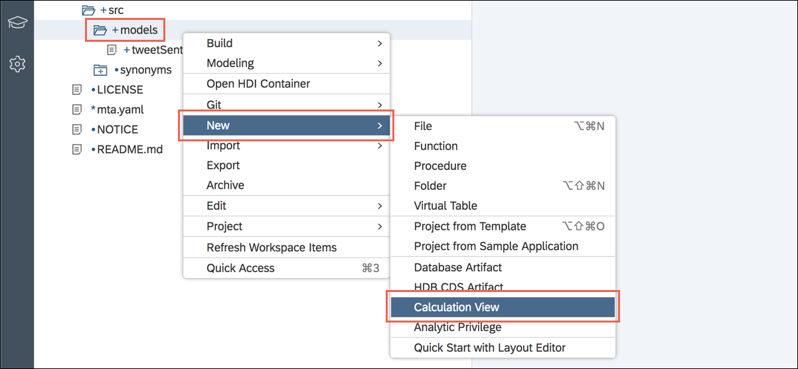  
Enter **tweetsOverTime** as **Name**, **Tweets over time** as **Label** and click **Create**.  
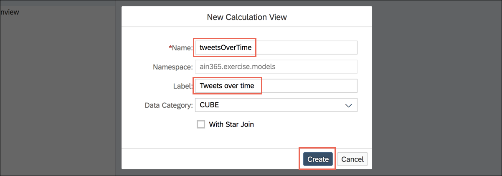  

> **NOTE**
>
> We need to add three parameters with multiple values to the calculation view and map it with the view from the synonym. To simplify this step, we insert the parameters directly to the XML file.

 

Right-click on the newly created calculation view "**tweetsOverTime.hdbcalculationview**" and select **Open Code Editor**.  
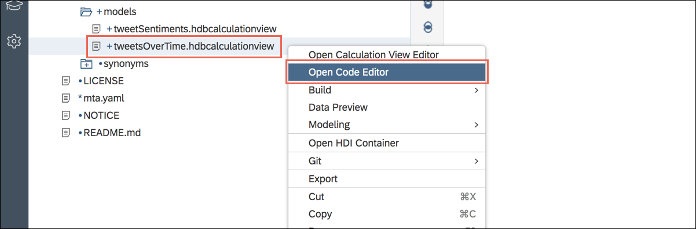  
Mark the text `<localVariables/>` in line 4 and replace it with the the [snippet](../misc/localVariables.txt) copied from the documentation repository.   **Don't forget to save the XML file.**  
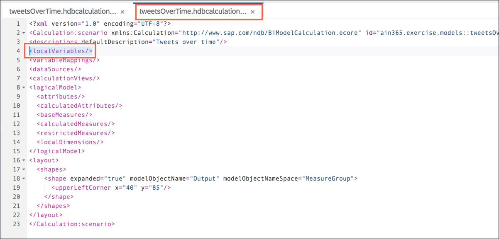  
The XML file should look like this afterwards:  
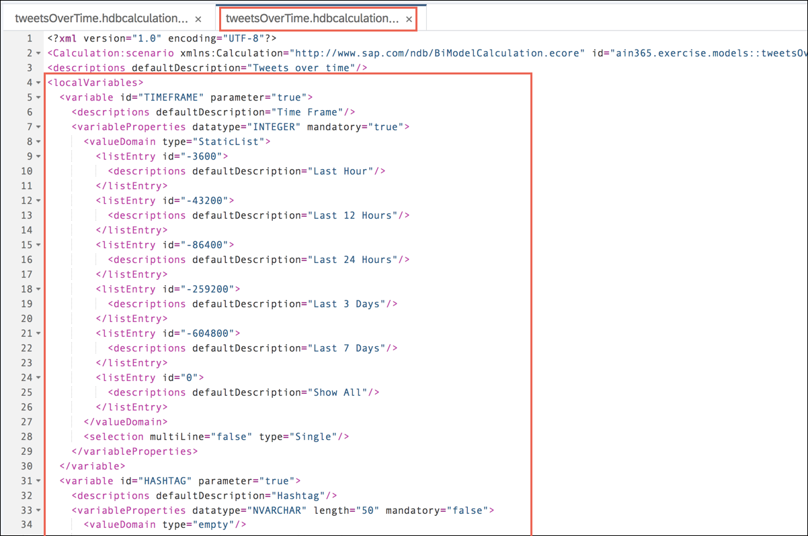  
Switch back to the graphical editor and click the **Plus** [1] sign on the **Aggregation** node.  
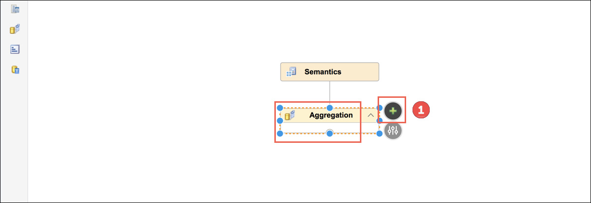  
In the **Find Data Sources** dialog search for **Tweets** [1] and **select the Tweets view** [2]. Afterwards click on **Finish**.  

> **!! CAUTION !!**
>
> Pay attention to the names shown in the results table. You will find the views from exercise 1 in the "Synonyms" column.

 

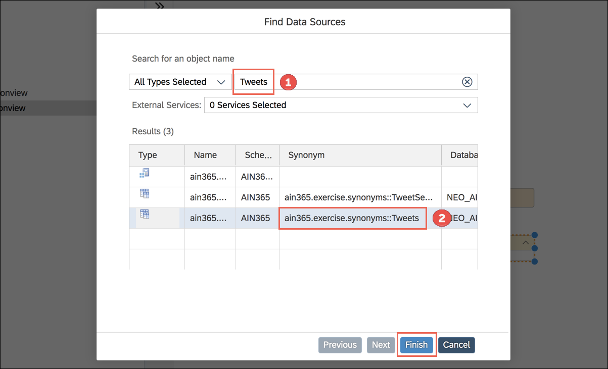  
Click on the **Expand Details Panel** [1] icon next to the **Aggregation** node.  
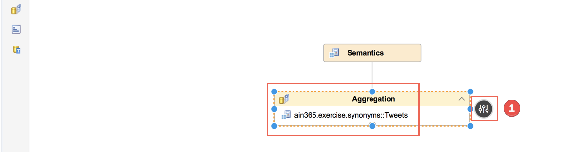  
Navigate to the **Mapping** section.  
Drag & Drop the columns listed below to the output columns.  

> **NOTE**
>
> You can also drag & drop "ain365.exercise.synonyms::Tweets" and delete afterwards "USERNAME", "CC_CREATED" and "CC_TIMEBASKET". Therefore you have to mark the three columns in the Output Columns and click on "Delete".

 

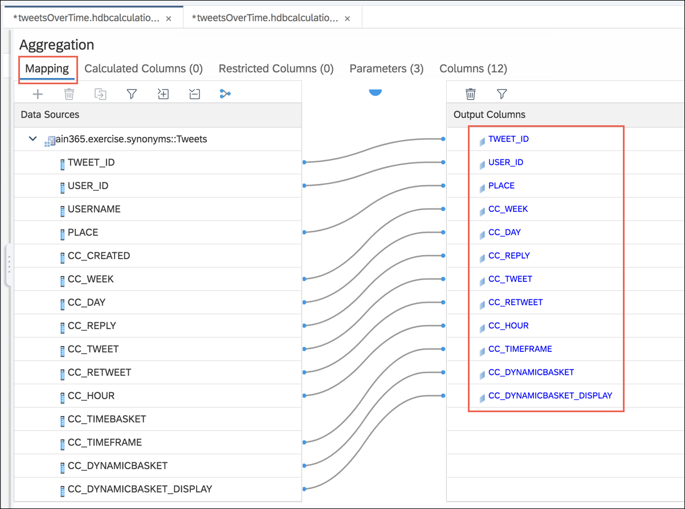  
Switch to **Calculated Columns** [1], click on the **Plus** [2] sign and choose **Counter** [3]. A new item will be created in the table. Click on it to enter the details.  
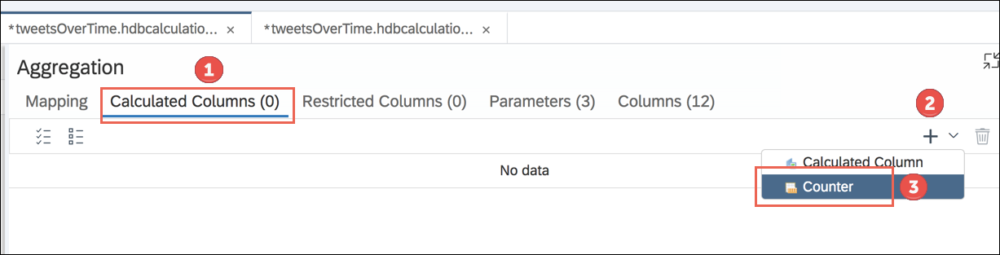  
Enter **NO_OF_ENTRIES** as **Name** [1], **No. of Entries** as **Label** [2], click on the **Plus** sign [3] in the **Counter** section and select **TWEET_ID** [5] as column from the **value help** [4]. Afterwards click **Back** on the top left of the dialog.  
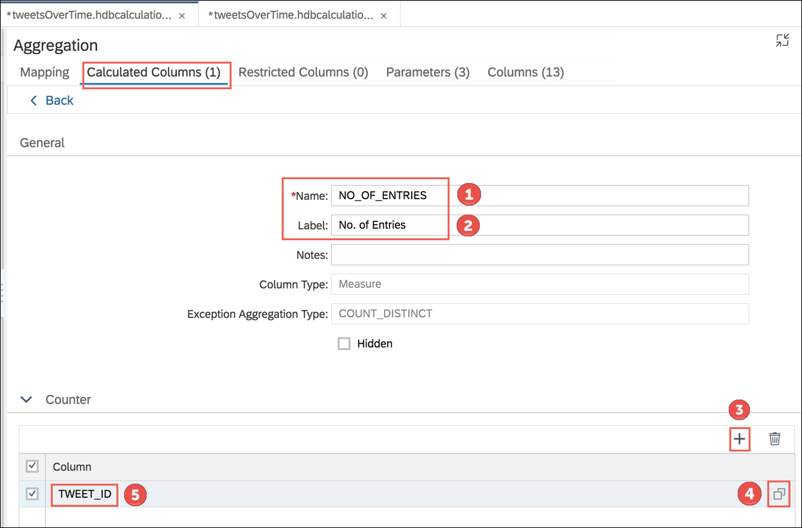  
Create four more **Counter** entries with the names **NO_OF_TWEETS (CC_TWEET)** [1], **NO_OF_REPLIES (CC_REPLY)** [2], **NO_OF_RETWEETS (CC_RETWEET)** [3] and **NO_OF_TWEETERS (USER_ID)** [4]. Please use the values in the bracket as the column for the section **Counter**.  
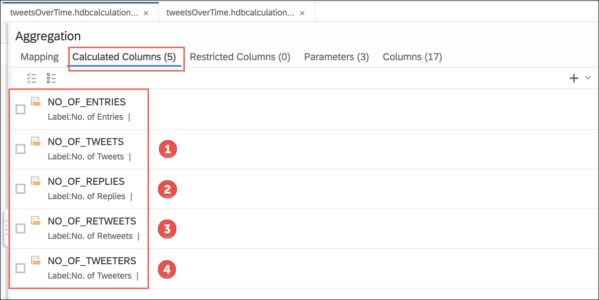  
Switch to section **Parameters** [1] and click on the **Manage Parameter Mapping** [2] icon.  
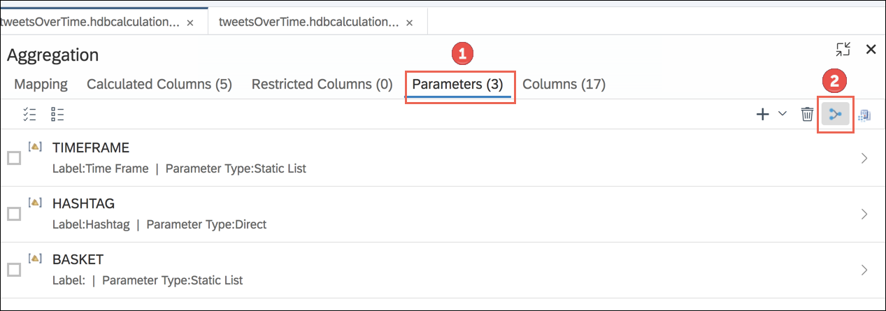  
In the **Manage input parameter mappings** section click on the **Auto Map by Name** icon [1]. As the names are the same it will automatically map the parameters.  
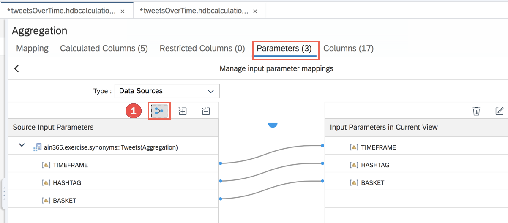  
Click on **Semantics** in the **Calculation View Modeler** and open the **Details panel**.  
Choose the section **Columns** and check that the **Label** [1] columns are identical as on the screenshot below. There should be no difference if you followed the instruction. In addition set the columns **USER_ID** [2], **CC_REPLY** [2], **CC_TWEET** [2], **CC_RETWEET** [2] and **CC_DYNAMICBASKET_DISPLAY** [2] to **Hidden** and map the field **Label Column** for the entry **CC_DYNAMICBASKET** to **CC_DYNAMICBASKET_DISPLAY** [3].  
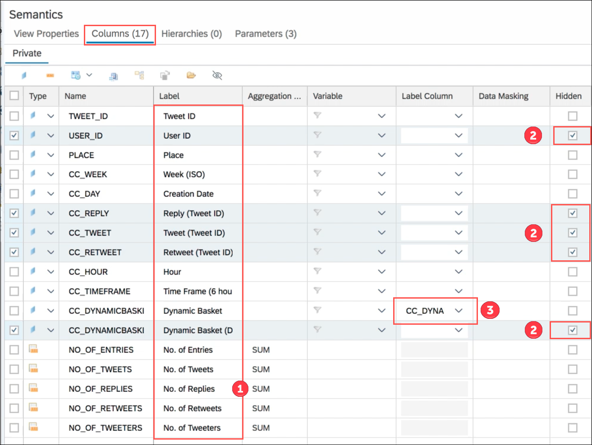  
Navigate to the section **Hierarchies**, click on the **Plus** [1] sign and select **Level Hierarchy** [2].  
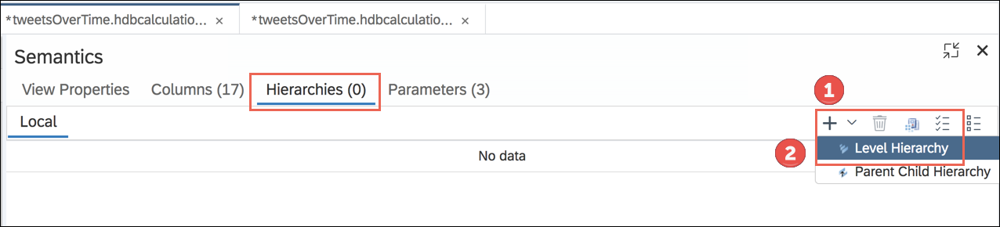  
A new entry will be created in the table. Click on it (LEVEL_1) to proceed.  
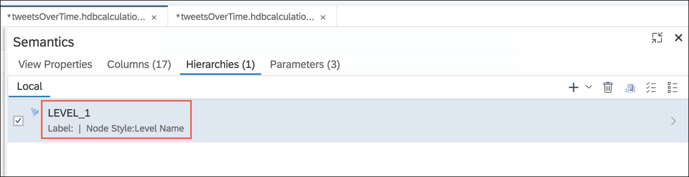  
Enter **TIME_HIERARCHY** as **Name** [1], **Hierarchy by time** as **Label** [2] and select **Name Path** as **Node Style** [3].  
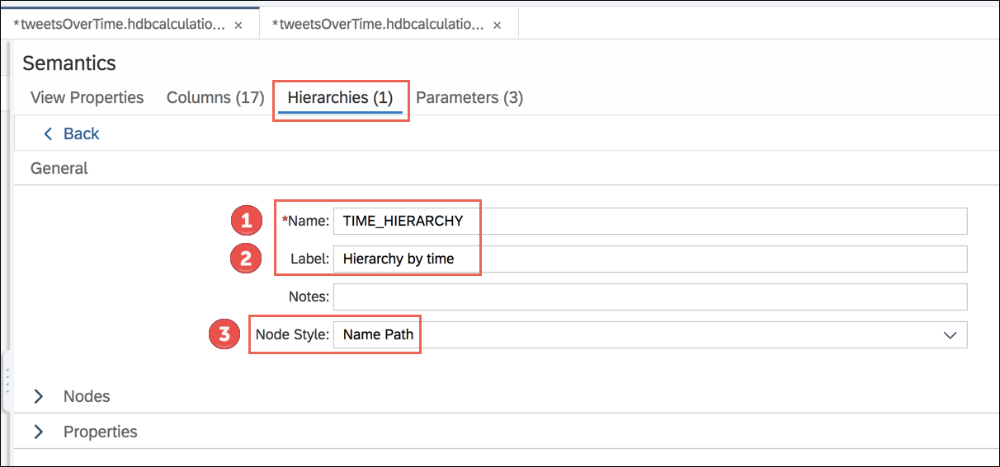  
Open **Nodes** [1] and create four entries with the **Plus** [2] sign. Add **CC_WEEK** [3] as first, **CC_DAY** [4] as second, **CC_TIMEFRAME** [5] as third and **CC_HOUR** [6] as fourth entry.  
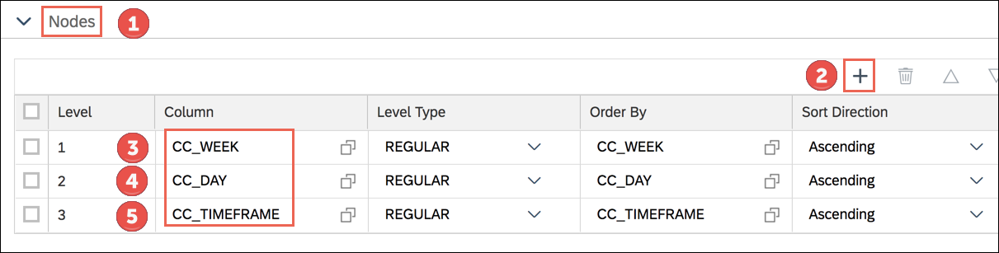 
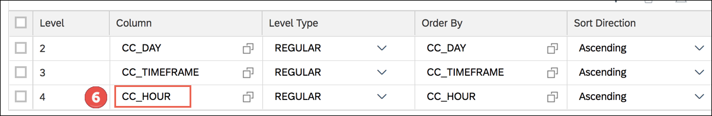  
Right-click on the calculation view **tweetsOverTime.hdbcalculationview**, choose **Build** > **Build Selected Files** and wait until the build has finished successfully.  
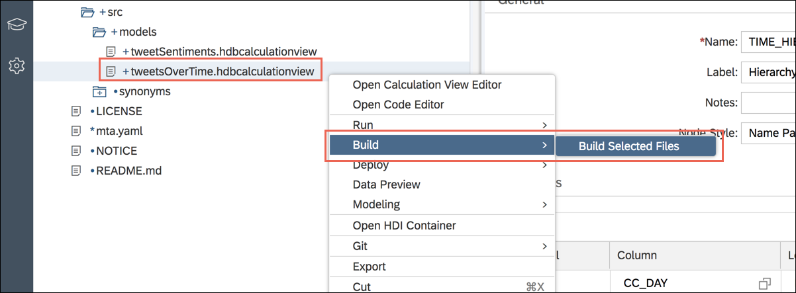  
Navigate to the **Database Explorer** [1] and select again **Column Views** [2]. Filter for **tweetsOverTime** [3], right-click on the view "**ain365.exercise.models::tweetsOverTime**" [4] and choose **Open Data** [5].  
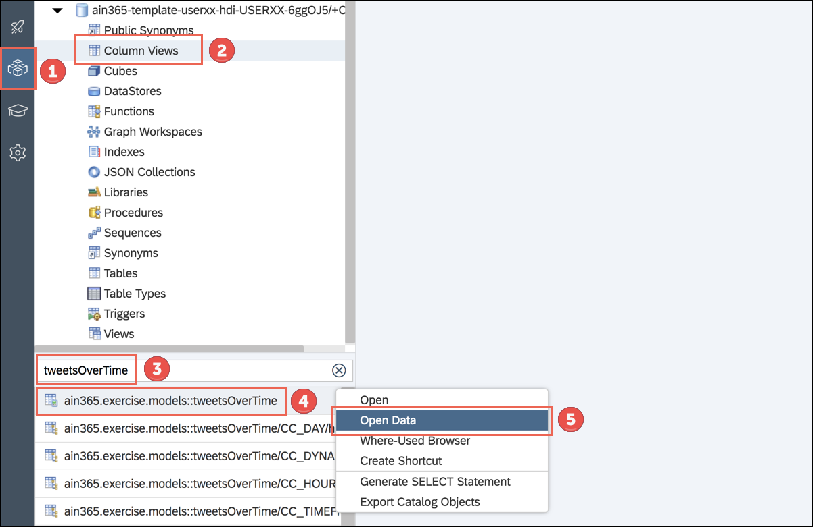  
Set the **Input Parameters** for **TIMEFRAME** [1] to the value **0** and keep the other settings untouched. Afterwards click on the **Open Content** [2] button.  
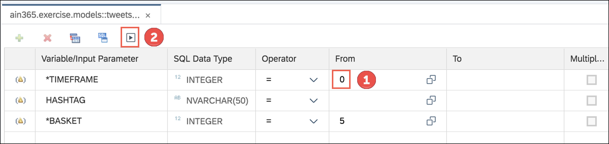  
Select **CC_DYNAMICBASKET_DISPLAY** as **Label Axis** [1] and the measures **NO_OF_ENTRIES**, **NO_OF_TWEETS**, **NO_OF_REPLIES**, **NO_OF_RETWEETS** and **NO_OF_TWEETERS** to the **Value Axis** [2]. You should see a simple bar chart visualizing the sentiments by calendar week.  
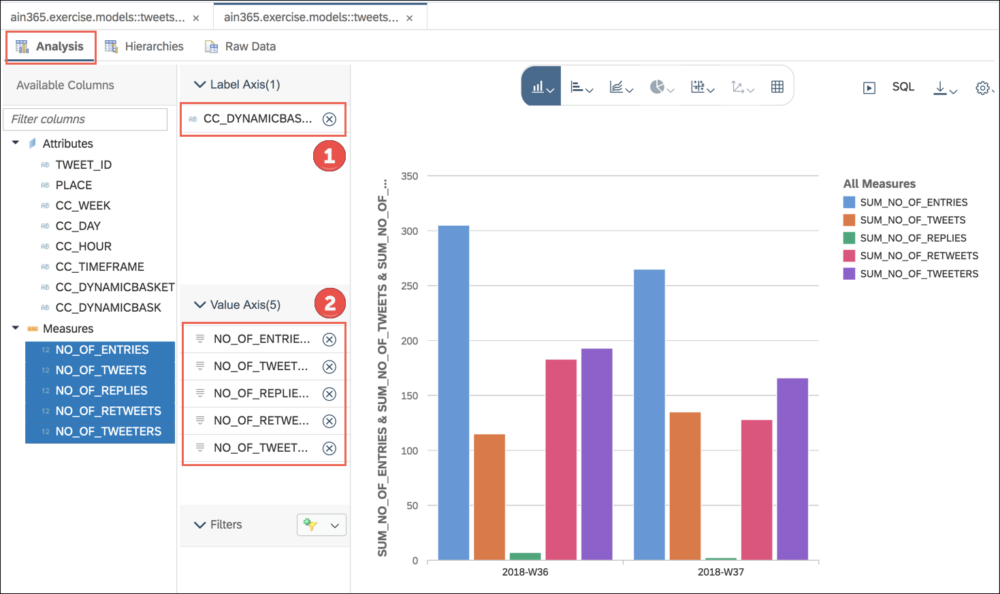  
Switch to the **Hierarchies** tab. Select **TIME_HIERARCHY** as **Selected Hierarchy** [1] and **NO_OF_ENTRIES** as **Selected Measures** [2]. Drill-down on the output table to the various levels [3].  
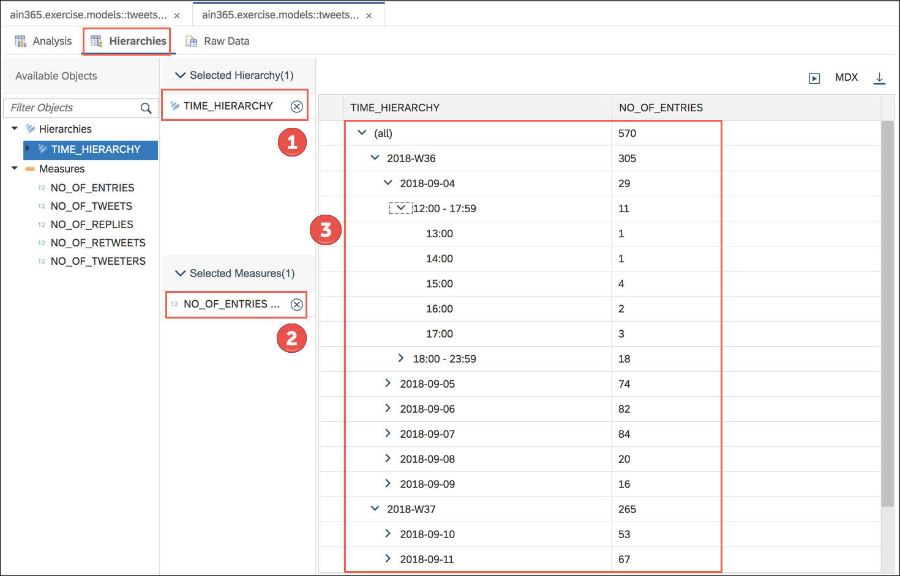  
Switch back to the **Project Explorer**. Right-click on the **project** named **ain365-template** and choose **Build** > **Build**. This will create a **Multi-Target Application Archive** (MTAR).  
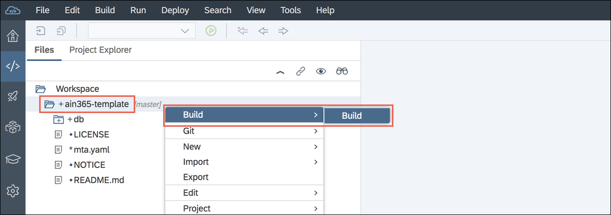  
Navigate to the folder containing your user via **mta_archives** [1] > **userxx-exercise** (e.g. user01-exercise) and right click on the **mtar** [2] file (here userxx-exercise_1.0.0.mtar). Choose **Deploy** > **Deploy to SAP Cloud Platform** [3].  
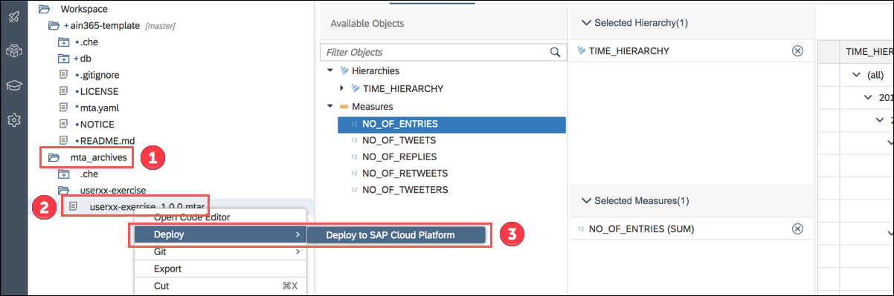  
Select your **Cloud Foundry API Endpoint** [1] and keep the default **Organization** [2] and **Space** [3]. Afterwards click on **Deploy**  
> **!! CAUTION !!**
>
> Please use the API endpoint "https://api.cf.eu10.hana.ondemand.com" for Barcelona and Bangalore and "https://api.cf.us10.hana.ondemand.com" for Las Vegas.

 

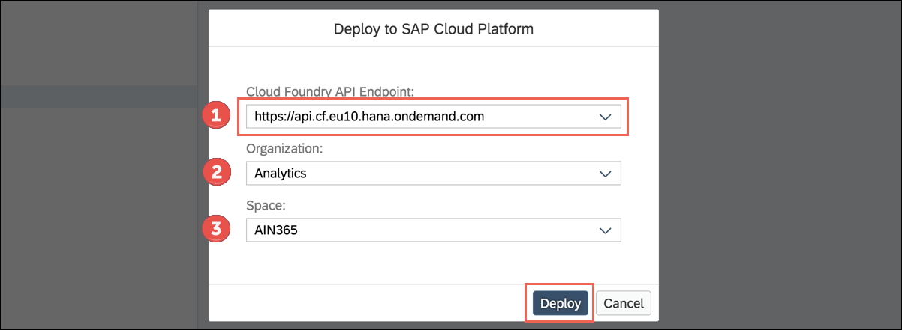  
Wait until the deploy process has been finished successfully. This can take up to 5 minutes. You will get a confirmation message as notification [1] and in the console [2] once the deployment has been finished.  
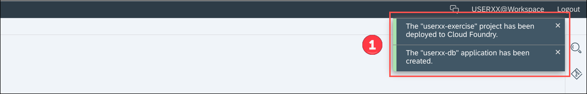 
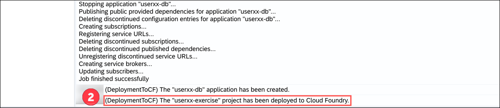  
**Congratulations! You have successfully completed the third exercise.**   

## Next Steps
Continue with [Exercise 4](../exercise4/README.md) and deploy the SAP HANA Analytics Adapter to Cloud Foundry.
   

## License

This project is licensed under the SAP SAMPLE CODE LICENSE AGREEMENT except as noted otherwise in the [LICENSE file](../LICENSE).
