#### AIN365

## Exercise 4 - Setup HANA Analytics Adapter

In this exercise you will expose the SAP Info Access (InA) protocol to the outside using the Analytics adapter for SAP HANA extended application services, advanced model (XSAHAA). You will view the important steps in the application code and use Jenkins to build and deploy a Multi-Target application (MTA) to Cloud Foundry.  
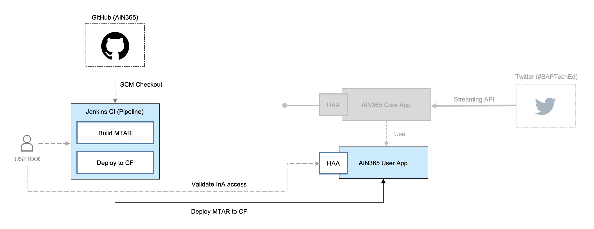  
The planned duration for this exercise is 10 minutes. You can find a recording of the exercise [here](https://youtu.be/5S37Ztv22gY).   

## Steps

Run the following steps to complete the exercise:  

Open the **AIN365 Launchpad** in Google Chrome and click on the **Jenkins CI** tile.  
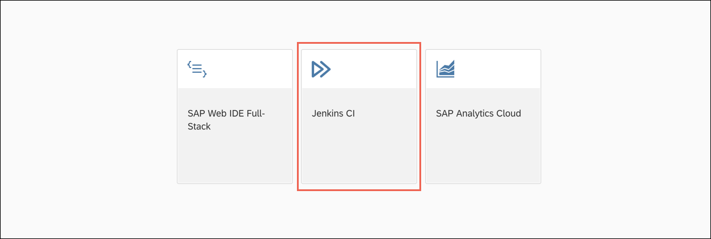  
Logon with your **AIN365 Jenkins user** (user + your number, e.g. user01) and **Welcome18** as password.  
  
Click on **XSAHAA-master-build**.  
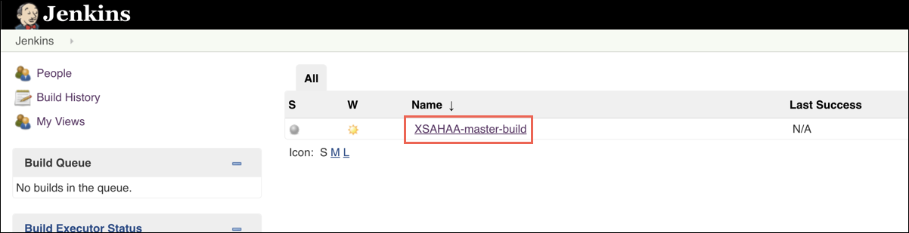  
Select **Build with Parameters** [1] and enter your **userId**, e.g. **userxx** [2] and your hdi container name, e.g. **userxx-hdi** as **hdiContainerName** [3]. Afterwards click on Build.  
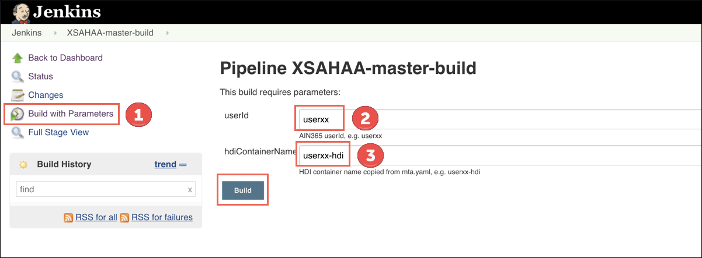  
The pipeline will start to run. It can take up to 5 minutes until it has been finished.

>**NOTE**
>
> During this time you can for example read the optional info at the bottom of this page.

 

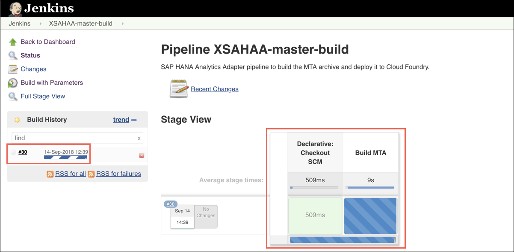  
Once **all three stages** [1] are green, click on the **green icon** [2] next to the **build number** on the left (e.g. here #30).  

> **NOTE**
>
> All three stages/steps means: Declarative: Checkout SCM, Built MTA and Deploy to CF.

 

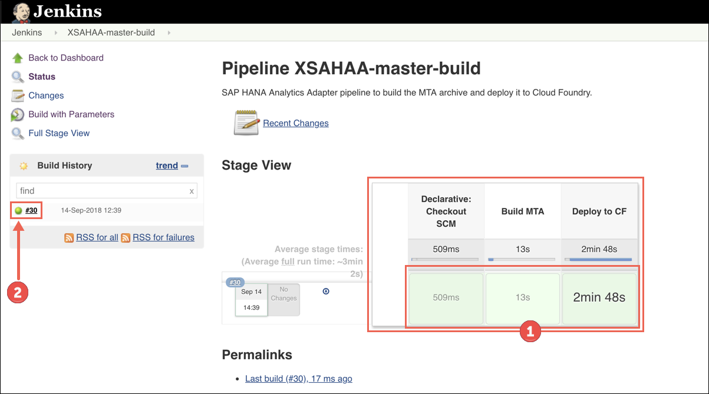  

> **NOTE**
>
> You can identify the build for your user by hovering over the **Download / Archive** icon [1] and find the user in the file name [2], e.g. **xsahaa-master-USER.mtar**.

 

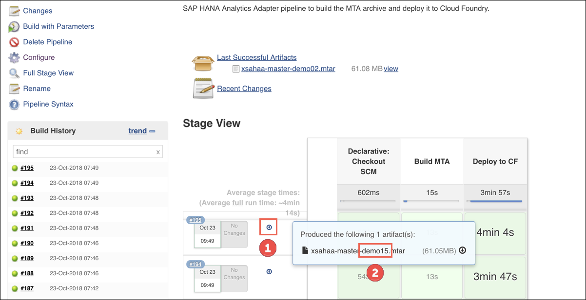  
Click on **Console Output** and scroll to the bottom of the screen.  
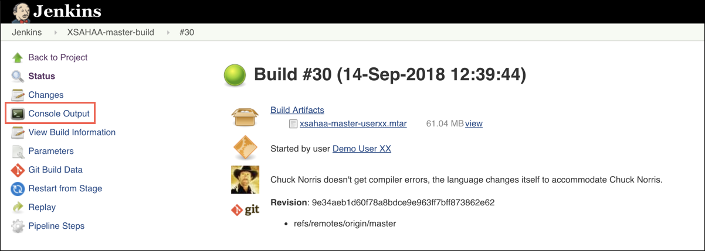  
You will find the **URL** of the deployed **SAP HANA Analytics Adapter**, e.g. (https://userxx-xsahaa.DOMAIN). Right-click on the link and click **Open in a new tab**.  

> **NOTE**
>
> There are multiple URLs in the Console Output. Please ensure that you use userxx-xsahaa, e.g. user01-xsahaa. The backend link user01-xsahaa-backend won't work.

 

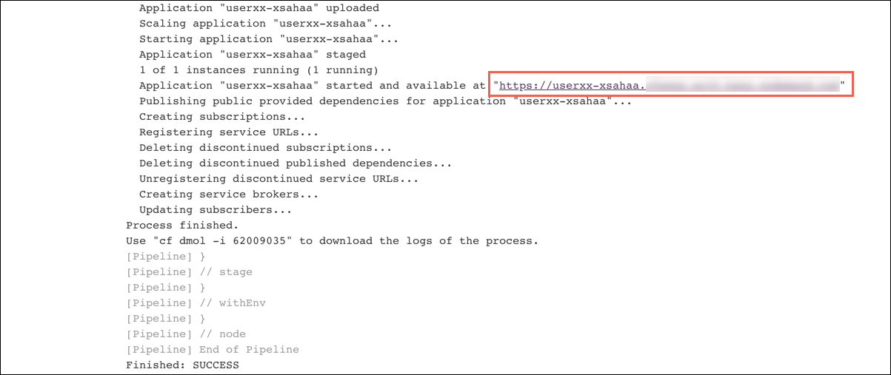  
The XSAHAA will automatically log you in and route you to **YOUR_HOST/sap/bc/ina/services/v2/GetServerInfo** (configured in the app router). Ensure that you get suitable data for the SAP HANA, e.g. Server Type, SystemId, Version and so on. The SAP Analytics Cloud will later on communicate with this InA protocol shown on the screen.  .
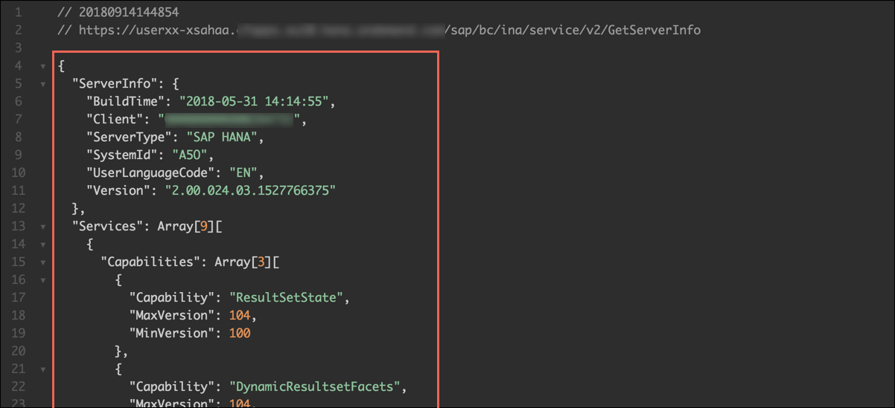  
In addition, open **YOUR_HOST/sap/bc/ina/services/v2/HeartBeat**. Here you see some of the settings like userName, applicationUser, etc.  
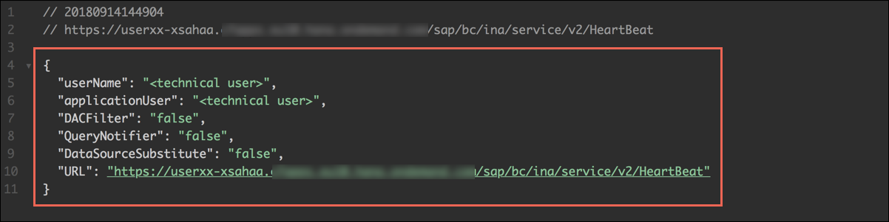  

**Congratulations! You have successfully completed the fourth exercise.**   

## Next Steps
Continue with [Exercise 5](../exercise5/README.md) and prepare SAP Analytics Cloud.
   

## Optional Info: Jenkins
Jenkins is an open source automation server written in Java. Jenkins helps to automate the non-human part of the software development process, with continuous integration and facilitating technical aspects of continuous delivery. It is a server-based system that runs in servlet containers such as Apache Tomcat.  
Source: [Wikipedia](https://en.wikipedia.org/wiki/Jenkins_(software))
   

## Optional: Additional Infos
The SAP HANA Analytics Adapter (**ain365-xsahaa**) project has been already implemented. This optional section gives you information on the files and modules contained in this predefined application.  
It consists of two modules; the **xsahaa** module which consumes the SAP HANA Analytics Adapter provided as a WAR file and the **approuter** module which we require to route and expose the provided destination.
  

> **NOTE**
>
> You can download the SAP HANA Analytics Adapter from https://tools.hana.ondemand.com/#hanatools > Analytics Adapter for SAP HANA extended application services, advanced model.

 

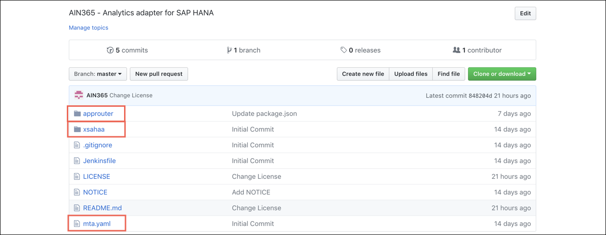  
The **xsahaa** module contains only a **pom.xml** where we define a dependency to the **WAR** file [1], e.g. in Nexus. In addition the **maven-dependency-plugin** is used to copy the artefact (see copy goal [2]) to our build directory [3] and finally package it into the Multi-Target Application (MTA).  
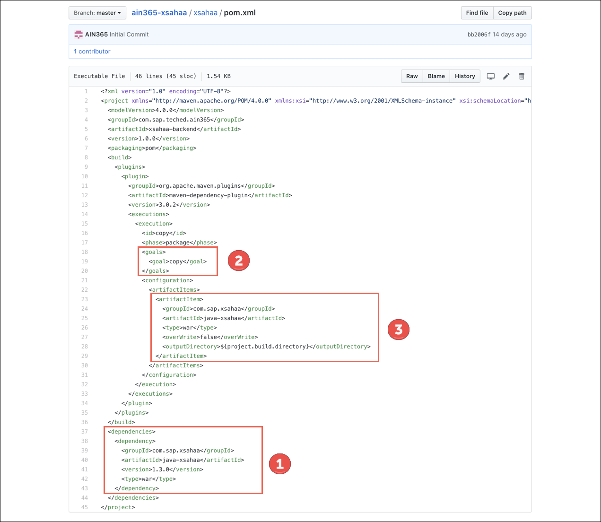  
In the **approuter** module we simply define in **package.json** a dependency to the **@sap/approuter** and add the start script.  
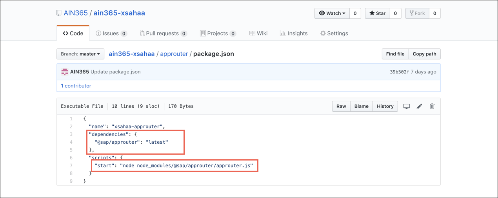  
The **mta.yaml** puts everything together. First we specify the required resources [1] (a XSUAA service and the HDI container of our application). In addition both resources are required [2] by the **xsahaa** module named **ain365-xsahaa-backend** (the WAR file). Besides that the **xsahaa-backend** [3] is provided, the runtime **tomee** is specified [4] as well as some additional settings like **cors-origin** [4] and the relevant **hdi-container** [4] are added. Finally the **XSUAA** [5] and a destination to the exposed **xsahaa-backend** [5] is defined as required in the **approuter** module.     
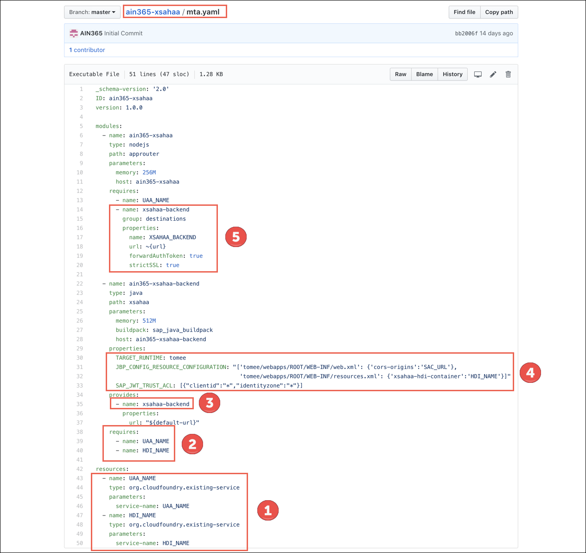
   

## Next Steps
Continue with [Exercise 5](../exercise5/README.md) and prepare SAP Analytics Cloud.
   

## License

This project is licensed under the SAP SAMPLE CODE LICENSE AGREEMENT except as noted otherwise in the [LICENSE file](../LICENSE).
