#### AIN365

## Exercise 5 - Prepare SAP Analytics Cloud
In this exercise you will use the exposed InA service and create a connection from SAP Analytics Cloud. Afterwards, you create the models out of the calculation views and clone the template story.   
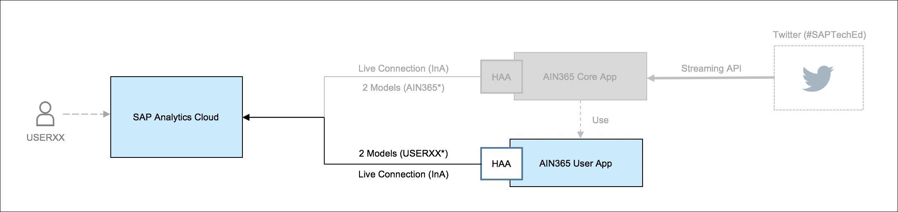  
The planned duration for this exercise is 10 minutes. You can find a recording of the exercise [here](https://youtu.be/fxzAUeaWsZ8).   

## Parameters

During the exercise you will require the URL to SAP Analytics Cloud (**AIN365_ANALYTICS_CLOUD**). You can observe the parameter from the **parameters.html** file located on your image.   

## Steps

Run the following steps to complete the exercise:  

Open the **AIN365 Launchpad** in Google Chrome and click on the **SAP Analytics Cloud** tile. The system will log you automatically on to as Single-Sign On is configured for the instance.  
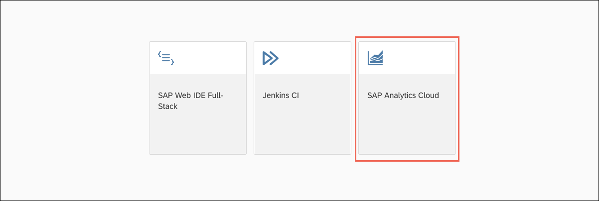  
Click on the **menu** bar and select **Connection**.  
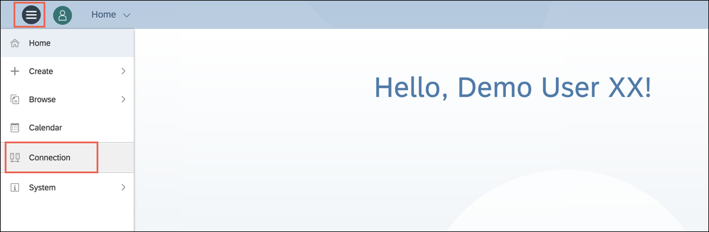  
Click on the **Plus** [1] sign and select **Live Data Connection** > **SAP HANA** [2].  
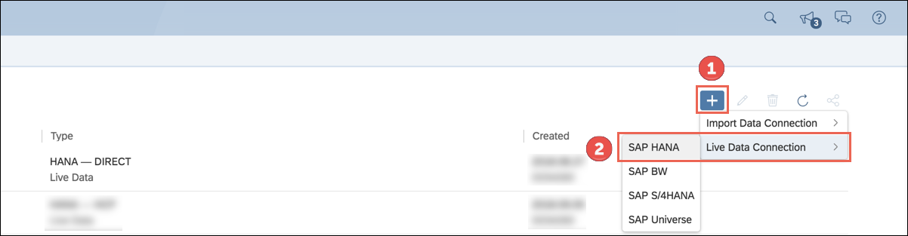  
Enter your username, e.g. **USERXX** as **Name** [1], **HANA Live Connection to Cloud Foundry** as **Description** [2], **Direct** as **Connection Type** [3], your **XSAHAA URL** (only host without protocol and port, e.g. userxx-xsahaa.domain.com - this URL was already used during exercise 4) as **Host** [4], **443** as **HTTPS Port** [5], **EN** as **Default Language** [6] and **SAML Single Sign On** as **Authentication Method** [7]. Afterwards click on **OK**.  
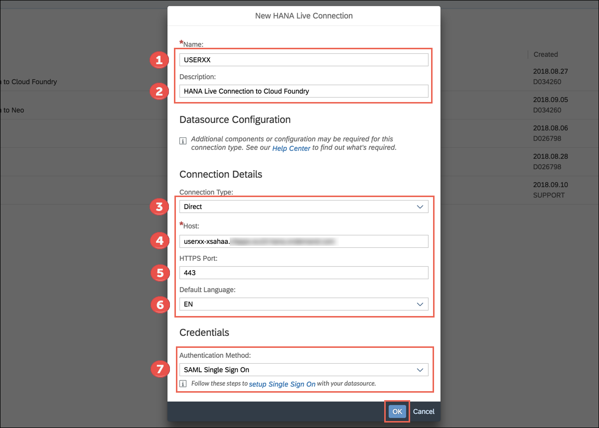  
The newly created connection appears in the **Connection Dialog**.  
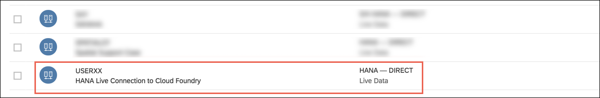  
Click on the **Menu** bar and select **Create** > **Model**.  
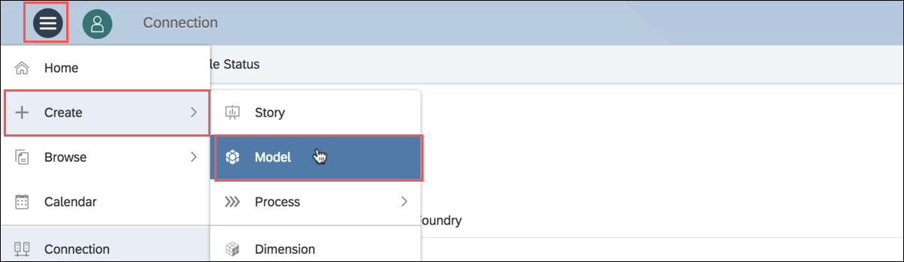  
Select **Get data from a datasource**.  
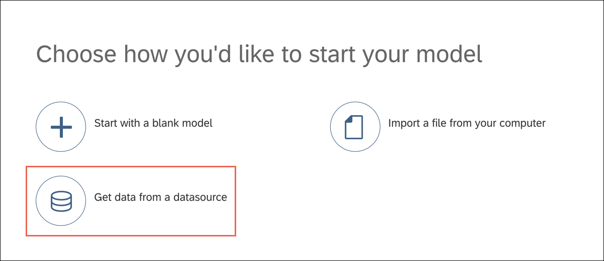  
Click **Live Data Connection** on the right-hand side.  
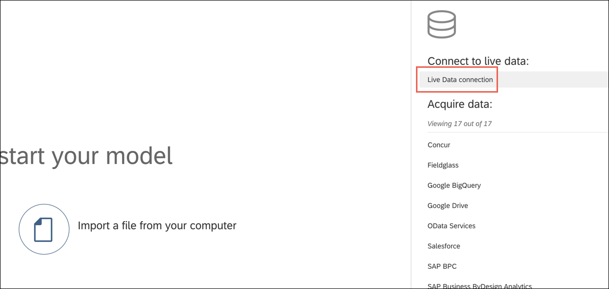  
Select **SAP HANA** as **System Type** [1], **USERXX** (e.g. USER01) as **Connection** [2], **tweetSentiments** as **Data Source** [3] using the value help and enter **USERXX_TWEETSENTIMENTS**, e.g. USER01_TWEETSENTIMENTS as **Name** [4] and **CV tweetSentiments** as **Description** [5]. Afterwards click on **OK**.  
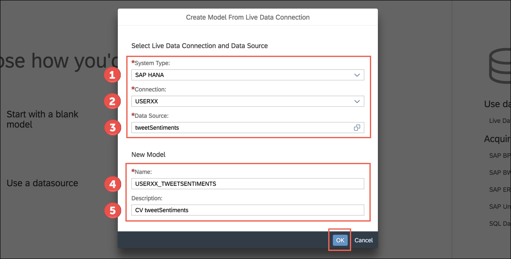  
Ensure that you can see the three measures you created in the **calculation view** [1]. Afterwards click on **All Dimensions** [2].  
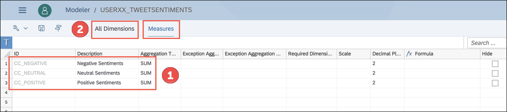  
Change the **Description** for the fields to the ones on the screenshot below. Add **Tweet ID** for **TWEET_ID** [1], **Place** for **PLACE** [2] and **Dynamic Timeframe** for **CC_DYNAMICBASKET** [3]. Finally click on the **Save** button [4].  
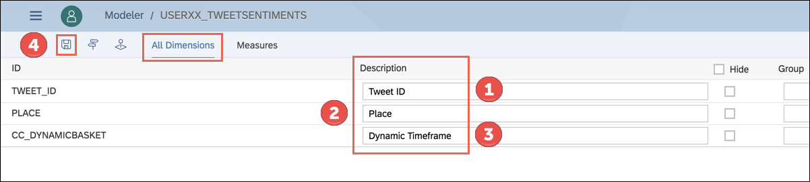  
Repeat the steps for the second calculation view. Select **SAP HANA** as **System Type** [1], **USERXX** (e.g. USER01) as **Connection** [2], **tweetsOverTime** as **Data Source** [3] using the value help and enter **USERXX_TWEETSOVERTIME**, e.g. USER01USERXX_TWEETSOVERTIME as **Name** [4] and **CV tweetsOverTime** as **Description** [5]. Afterwards click on **OK**.  
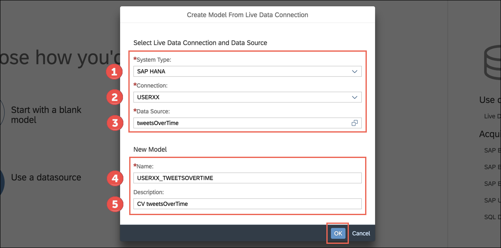  
Check that there are the five measures in the list [1] and click on **All Dimensions** [2].  
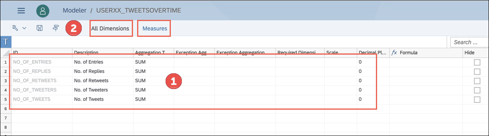  
Change the values for **Description** for the fields to the ones on the screenshot below. Add **Hierarchy by time** for **TIME_HIERARCHY** [1], **Tweet ID** for **TWEET_ID** [2], **Place** for **PLACE** [3], **Week** for **CC_WEEK** [4], **Day** for **CC_DAY** [5], **Hour** for **CC_HOUR** [6], **Timeframe** for **CC_TIMEFRAME** [7] and **Dynamic Timeframe** as **CC_DYNAMICBASKET** [8]. Afterwards click on **Save** [9].  
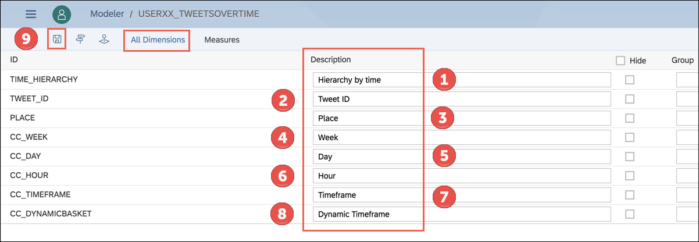  
Select the **menu** and navigate to **Browse** > **Files**.  
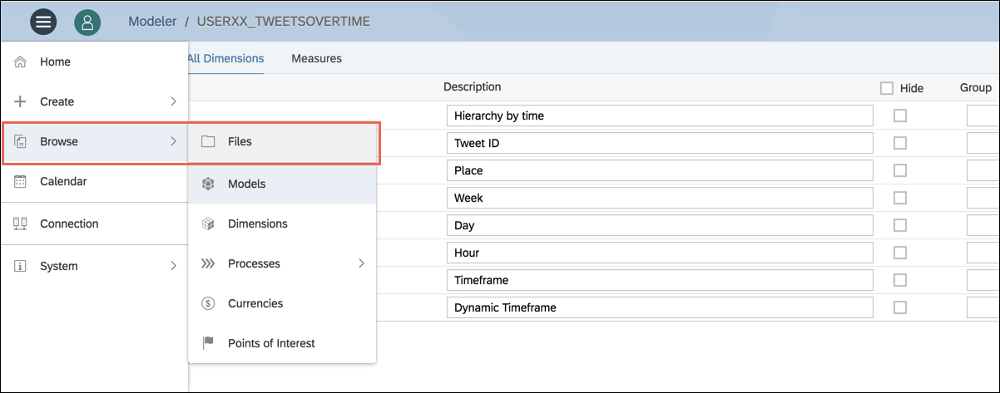  
Browse to **My Files** > **AIN365** [1], select the **AIN365_DASHBOARD_TEMPLATE** [2] and click on the **Copy To** [3] icon in the menu bar.  
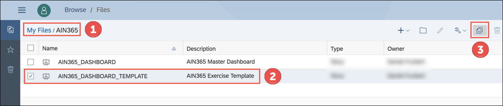  
Change the **Name** [1] to **USERXX_DASHBOARD**, e.g. (USER01_DASHBOARD) and the **Description** [2] to **AIN365 Exercise USERXX**. Finally click on **OK**.  
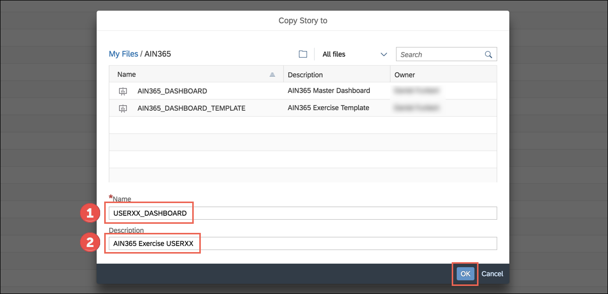  
The duplicated dashboard will be listed under **My Files** > **AIN365**.  
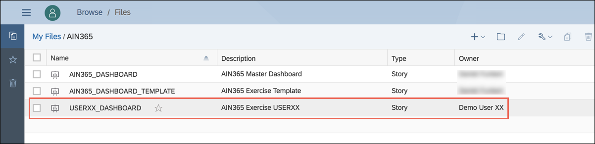  

**Congratulations! You have successfully completed the fifth exercise.**   

## Next Steps

Continue with [Exercise 6](../exercise6/README.md) and build the dashboard in SAP Analytics Cloud.
   

## License

This project is licensed under the SAP SAMPLE CODE LICENSE AGREEMENT except as noted otherwise in the [LICENSE file](../LICENSE).
