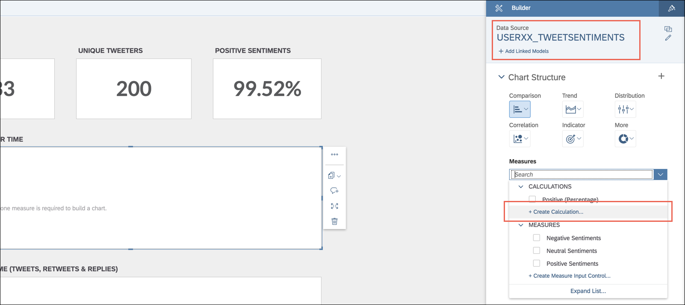

#### AIN365

## Exercise 6 - Implement your dashboard
In this exercise you will use the models created in exercise 5 and build various charts out of them. You will use the hierarchy to see the consumption with SAP Analytics Cloud, add some calculated columns and link the charts together.   
  
The planned duration for this exercise is 30 minutes. You can find a recording of the exercise [here](https://youtu.be/5-1rrDMJRWs).   

## Steps

Run the following steps to complete the exercise:  

Open your dashboard, e.g. USERXX_DASHBOARD.  
  
The template you copied already contains two charts with data coming from another predefined Calculation View. In these charts you can see on a map, where the Tweets are coming from and in the second chart you can see the current trending hashtags. You are now going to complete the right side of the dashboard.  
Click on the **Edit** button on the top right.  
  
In the **Insert** toolbar, click on the **Chart** icon to create a new visualization.  

> **NOTE**
>
> Once your SAP Analytics Cloud tab is too small (resolution), the **Chart** icon will move to the **More** section (... icon).

 

  
On the **Designer** change the predefined model **AIN365_TWEETSOVERTIME**.  
  
Select **USERXX_TWEETSOVERTIME**, e.g. USER01_TWEETSOVERTIME from the drop-down and click on **OK**.  
  
Confirm the **Set Variables** dialog with **Set** and keep the default values untouched.  
  
Change the **Chart Structure** (section **Indicator**) to **Numeric Point**.  
  
Mark the **visualization** [1] and select **No. of Entries** in **Primary Values** [2] under **Measures**.  
  
Click on the **visualization** [1] and select **...** > **Show/Hide** and hide everything except **Primary Values** [2].  
  
Drag & Drop the **visualization** with the **No. of Tweets** KPI (see screenshot above) to the **Total Tweets** container.  
  
Click on the **Styling** icon (subcategory of the Designer).  
  
On the visualization, click on the **value**. The color will change from black to orange.  

> **NOTE**
>
> It's important to click on the value (here 0). Otherwise you won't see the styling options (Font, Alignment) shown on the next step.

 

  
On the **Styling** dialog change the **Font** [1] to **Lato**, the **Size** to 48 and select **Center** as the **Alignment** [2] option.  
  
Select the visualization in the **Total Tweets** [1] container again and select **Copy** > **Duplicate** [2].  
  
Drag & Drop the duplicated item to the **Unique Tweeters** container.  
  
Change the measure under **Primary Values** from **No. of Entries** to **No. of Tweeters** [1].  
  
Select the visualization in the **Unique Tweeters** [1] container and **duplicate** [2] the item again (**Copy** > **Duplicate** [2]).  
Afterwards drag & drop it to the **Positive Sentiments** container. The tile is a bit smaller, therefore you have to resize it that it fits to container.  
  
Open the **Designer** [1] and ensure that you are on the **Builder** [2] level. Change the selected model **USERXX_TWEETSOVERTIME** [3], e.g. USER01_TWEETSOVERTIME.  
  
Confirm the **Warning** message.  
  
Select **USERXX_TWEETSENTIMENTS**, e.g. USER01_TWEETSENTIMENTS in the drop-down and confirm with **OK**.  
  
Keep again the **default values** and click on **Set**.  
  
Open the **Designer** and navigate to the **Builder**. Click on **Add Measure** under **Measures** > **Primary Values**.  
  
Select **Calculations** > **Create Calculation**.  
  
Enter **Positive (Percentage)** as **Name** [1] and construct the formula in the **Edit Formula** [2] using the automcomplete feature (see note).   `CC_POSITIVE / (CC_POSITIVE + CC_NEUTRAL + CC_NEGATIVE)`  Afterwards click on **OK**.  

> **NOTE:**
>
> Don't Copy and Paste the formula from the exercise, but type it into the "Edit Formula" field, yourself.  
> The formula editor will suggest you the correct values, meaning if you type in positive it will automatically suggest  "[USERXX_TWEETSENTIMENTS:CC_POSITIVE]". As the names of the models are different, please do not copy and paste the formula above and use instead the autocomplete functionality.

 

  
Click on the **...** [1] button next to the **Positive (Percentage)** measure and select **Format** [2].  
  
Uncheck **Use unit of the underlying measures** [1] first and select afterwards **Percentage** as **Scale** [2]. Close the dialog with **OK**.  

> **NOTE**
>
> It's important to uncheck the checkbox first. Otherwise you won't be able to select "Percentage".

 

  
In the section **Data** select the **Input Variables** dialog ({} icon) and click on **Link Variables**.  
  
Click on **Start a new variable link**.  

> **NOTE:**
>
> In case there are existing entries available in the dialog, ignore them and click on "Start a new variable link".

 

  
Each calculation view provides **Input Variables**. Link them that every change will update the  variables of other the models as well.  
Select **USERXX_TWEETSOVERTIME** [1], e.g. USER01_TWEETSOVERTIME on the left side and **AIN365_SPATIALTWEETS** [2] on the right side. Map the variables for **Time Frame** [3] and **Hashtag** [4] and click on **Set**.  
  
Keep the **default values** in the  **Set Variables** dialog and confirm with **Set**.  
  
Repeat the steps for the other two models and link **Time Frame** and **Hashtag** for **USERXX_TWEETSOVERTIME** [1] and **AIN365_TRENDINGHASHTAGS** [1] and **Time Frame**, **Hashtag** and **BASKET** for the models **USERXX_TWEETSOVERTIME** [2] and **USERXX_TWEETSENTIMENTS** [2]. Finally click on **Done**.  
  
On the dashboard, select the visualization **Postive Sentiments** [1] container and click on the **...** icon > **Show/Hide** [2] and hide everything except **Primary Values** [2].  
  
Click again on the **Insert** toolbar on the **Chart** icon to add a new visualization.  

> **NOTE**
>
> Once your SAP Analytics Cloud tab is too small (resolution), the **Chart** icon will move to the **More** section (... icon).

 

  
Drag & Drop the visualization to the **Sentiments over Time** container and adjust it.  
  
Click on **Measures** > **Add Measure** and select **Create Calculation**.  
  
Enter as **Name** the **Negative (Calculated)** [1] and choose `- (CC_NEGATIVE)` as formula [2]. Again please use the autocompletion functionality to use the right measure. Afterwards click on **OK**.  
  
In addition add **Positive** [1] and **Neutral** [2] as **Measures** and **Dynamic Timeframe** [2] as **Dimension** (section Dimensions). Re-order the elements as shown on the screenshot below (Positive Sentiments, Neutral Sentiments and Negative (Calculated)).  
  
Ensure that the visualization is still selected.  
Under the section **Color** click on the **color icon** [1] for each measure and open the advanced in the dialog by clicking on **More** [2]. Set the **Hex** [3] value `c9dc92` for **Positive**, `d9db8e` for **Neutral** and `fb9c82` for **Negative (Calculated)**.  
  
On the **Builder** [1] section change the **Chart Orientation** [2] to **Vertical**.  
  
Switch to the **Styling** [3] section and choose **Horizontal** as **Axis Label Direction** [4].  
  
Navigate back to the **Designer** and change the **Chart Type** to **Comparison** > **Stacked Bar/Column**.  
  
Select the **...** icon on the **Sentiments over time** container, navigate to **Show/Hide** and deselect everything except **Data Labels** [1] and **X Axis Labels** [1].  
  
Add another chart. Therefore click on the **Chart** icon in the section **Insert**.  

> **NOTE**
>
> Once your SAP Analytics Cloud tab is too small (resolution), the **Chart** icon will move to the **More** section (... icon).

 

  
Change the **Model** in the **Designer**, select **USERXX_TWEETSOVERTIME**, e.g. USER01_TWEETSOVERTIME from the drop-down menu and click **OK**.  
  
Add **No. of Replies** [1], **No. of Retweets** [1] and **No. of Tweets** [1] as **Measures** [1] and select the hierarchy **Hierarchy by time** [2] as **Dimension** [2].  
  
Change the **Chart Structure** to **More** > **Marimenko**.  
  
Test the hierarchy. Therefore select a **Measure** on the chart, e.g. **No. of Retweets** and click on the drill-down icon.  
  
Repeat the step a few times until you have reached another level like **Day**.  
  
Switch the dimension from the hierarchy to **Dynamic Timeframe**.  
  
Change the **Color Palette** [1] to the one with the four green tones [2] as shown on the screenshot below.  
  
Invert the order by clicking on the **Change first and last color** icon.  
  
Click on the **...** icon > **Show/Hide** and hide everything except **Data Labels** [1] and **X-Axis Labels** [1].  
  
Select the visualization in the **Positive Sentiments** [1] container and click in the **Designer** on **Color** > **Create Threshold** [2].  
  
Select **Positive (Percentage)** [1] as **Measure** and click on the **Add Range** [2] link. A second range will appear on the list.  
  
Repeat the step above and ensure that you have created **three range values**; one for **OK**, one for **Warning** and one for **Critical**.  
Set the values for **OK** to `>= 67 & <= 100` [1], for **Warning** to `>= 34 & < 67` [2] and for **Critical** to `>= 0 & < 34` [3]. Confirm with **Apply**.  
  
Select the created threshold in the **Color** section.  
  
The **Positive Percentage** tile changes the color dependent on the **Percentage**.  
  
Ensure that you have selected the **Total Tweets** visualization.  
Click on the **Linked Analysis** [1] icon on the top menu (section **Tools**) and set the option **Entire Story + This chart** [2]. Repeat the steps for every chart you added to the dashboard.  

> **NOTE**
>
> Once your SAP Analytics Cloud tab is too small (resolution), the **Linked Analysis** icon will move to the **More** section (... icon).

 

  
Click on the **Link Dimensions** icon (section **Data**).  

> **NOTE**
>
> Once your SAP Analytics Cloud tab is too small (resolution), the **Link Dimensions** icon will move to the **More** section (... icon).

 

  
Select on the left side **AIN365_SPATIALTWEETS** [1] and on the right side **AIN365_TRENDINGHASHTAGS** [2]. Map the **Place** [3] attribute on the left side with the **Place** [4] attribute on the right side and click on **Set**.  
  
Repeat the steps for the other two models (USERXX_TWEETSOVERTIME [1] and USERXX_TWEETSENTIMENTS [2]). Select always **AIN365_SPATIALTWEETS** on the left side and map the **Place** attribute. It's required to do this for Geo Spatial Filtering later on.  
Your **Link Dimension** should look like on the screenshot below.  
  
Your dashboard is complete. All calculation views have been integrated and linked together.  
  

**Congratulations! You have successfully completed the sixth exercise.**   

## Next Steps

Continue with the optional [Exercise 7](../exercise7/README.md) and validate the dashboard in SAP Analytics Cloud.
   

## License

This project is licensed under the SAP SAMPLE CODE LICENSE AGREEMENT except as noted otherwise in the [LICENSE file](../LICENSE).
