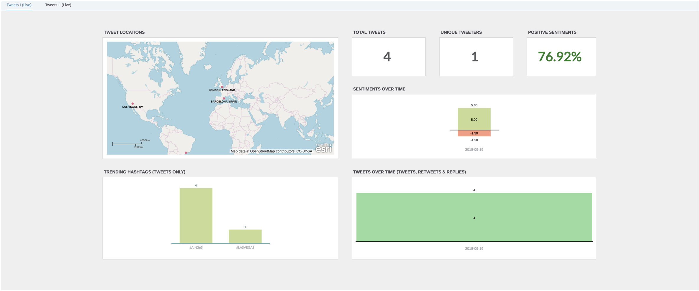

#### AIN365

## Exercise 7 - Validate your dashboard

This exercise is optional.

You will tweet on a predefined hashtag (e.g. #SAPTechEd) and prove that the Twitter dashboard is working as expected.
  
  
The planned duration for this exercise is 5 minutes. You can find a recording of the exercise [here](https://youtu.be/SyN_LxUnmQc).   

## Steps

Run the following steps to complete the exercise:  

In the AIN365 dashboard there's no **Geo Location** for **Barcelona, Spain** at the moment.  
  
Switch to **Twitter** and create a new tweet, e.g. with the text `I'm attending session #AIN365 on #SAPTechEd. I love it :-)` [1] and a custom Geo Location [2]. As an example **Barcelona, Spain** [3] is used here. Afterwards click on **Tweet**.  
  
Navigate back to your story and click **Refresh**.  
  
You should see at least one new Tweet with a **Geo Location** for the location you used in your Tweet (e.g. Barcelona, Spain). (Note: it might take up to one minute, until your Tweet can be displayed on the dashboard.)  
  
Click on **Input Variables** and select **AIN365_TRENDINGHASHTAGS**.  
  
Change the **Time Frame** to **Last 24 Hours**.  
  
You can now see the **Tweets** for the **Last 24 Hours**. Also the time frames change from **Day** to a range of **6 hours**.  
  
Click again on **Input Variables** and select **AIN365_TRENDINGHASHTAGS**.  
  
Select **Last 7 Days** for **Time Frame** [1] and any value you like, e.g. **#ain365** or #analytics as **Hashtag** [2]. Afterwards click on **Set**.  
  
You can see the **Last 7 Days** with all tweets containing **#ain365** in the dashboard.  
  
Click once more on **Input Variables** and select **AIN365_TRENDINGHASHTAGS**. Select **Show All** for **Time Frame** and confirm with **Set**.  
  
Select the **Geo Map**, click on the **Map Control** navigation and select the **Polygon Filter** [1]. Choose the **Square** filter [2].  
  
Mark the area you want to filter for, e.g. here on Europe. Afterwards click the **Filter** icon.  
  
You can see the **Tweets** filtered by **Geo Location**.  
  

**Congratulations! You have successfully completed the seventh exercise.**   

## Next Steps
Continue with [Exercise 8](../exercise8/README.md) and create a R visualization.
   

## License

This project is licensed under the SAP SAMPLE CODE LICENSE AGREEMENT except as noted otherwise in the [LICENSE file](../LICENSE).
