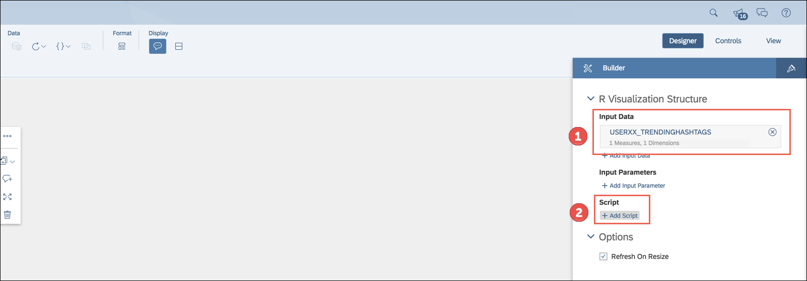

#### AIN365

## Exercise 8 - Extend with R Visualization
This exercise is optional.

You will use the extracted hashtags from the AIN365 core application and integrate a R visualization on the HANA 2.0 Live Connection (word cloud).
  
  
The planned duration for this exercise is 10 minutes. You can find a recording of the exercise [here](https://youtu.be/g4_SJeOr71s).   

## Steps

Run the following steps to complete the exercise:  

Open the **Menu** bar and select **Create** > **Model**.  
  
Choose **Get data from a datasource** [1] and select **Live Data connection** [2].  
  
Select **SAP HANA** as **System Type** [1], **AIN365CF** as **Connection** [2] and **trendingHashtags** as **Data Source** [3]. Afterwards name the model **USERID_TRENDINGHASHTAGS** [4] (e.g. USERXX_TRENDINGHASHTAGS) and add **CV trendingHashtags** as **Description** [5]. Finally click on **OK**.  
  
Keep the default settings and click **Save**.  
  
Navigate back to your story via **Menu Bar** > **Browse** > **Files** and select your story.  
Switch to the tab **Tweets II (Live)** and click on the **Plus** [1] sign to add a **R Visualization** [2].  

> **NOTE**
>
> Once your SAP Analytics Cloud tab is too small (resolution), the **Plus** [1] icon will move to the **More** section (... icon).

 

  
Mark the **R Visualization** [1] and click in the **Designer** on **Add Input Data** [2].  
  
Click on the **Change** icon to select the newly created model.  
  
Confirm the warning message while changing the model.  
  
Select your model, e.g. **USER01_TRENDINGHASHTAGS** and click on **OK**.  
  
Change the **Time Frame** [1] to **Last 7 Days** and confirm the settings with **Set**.  
  
Click on **Add Dimensions** [1] in the **Rows** section, select **HASHTAG** [2] and click **OK** on the bottom right.  
  
You should see the model selected (e.g. USERXX_TRENDINGHASHTAGS) containing 1 Measure and 1 Dimension [1].  
Click on the **Add Script** [2] link.  
  
Click on the **Expand** screen to maximize the screen.  
  
Copy & Paste the [snippet](../misc/wordcloud.txt) to the **Editor**.  
  
Adjust the required parameters to your input model.  
Therefore change
- **YOUR_MODEL_NAME** [1] to your user, e.g. **USERXX_TRENDINGHASHTAGS**,
- **HASHTAG_TO_FILTER** [2] to **#SAPTECHED**,
- **data$HASHTAG_DIMENSION** [3] to **data$Hashtag** and
- **data$HASHTAG_MEASURE** [4] to **data$\`No. of Entries\`**.

Afterwards click **Execute** to preview or click directly on **Apply** to close the **editor**.  
  
Select the **R Visualization** [1], click on **More Actions** (...) > **Show / Hide** and disable all properties [2].  
  
The **word cloud** has been rendered using R Serve.  
In addition it's possible to link the input parameters with the one's from the other models within our story.  
  
Switch back to the **Editor** (**Edit Script** on the **Designer**). Change e.g. the **min.freq** of the words from **5** to **2** and play around with it. Afterwards confirm with **Apply**.  
  
You will find more **hashtags** on the visualization now.  
  

**Congratulations! You have successfully completed the eighth exercise.**   
**Congratulations! You have successfully completed all exercises of this TechEd session!**   

## License

This project is licensed under the SAP SAMPLE CODE LICENSE AGREEMENT except as noted otherwise in the [LICENSE file](../LICENSE).
